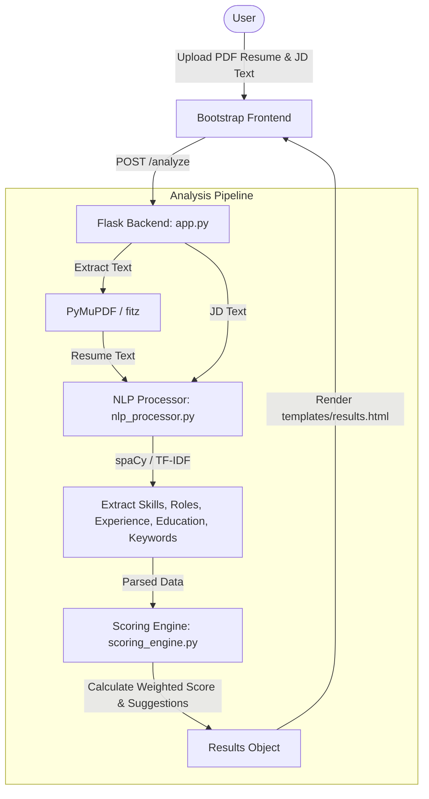

# Resume Job Fit Analyzer - Project Analysis

A detailed analysis of the **Resume Job Fit Analyzer** project, based on the codebase documentation and implementation files.

---

## 📋 Project Overview
The **Resume Job Fit Analyzer** is a Flask-based web application powered by Natural Language Processing (NLP). It allows users to upload a resume in PDF format and input a target job description to receive a compatibility score (0–100), key metrics breakdowns, matched vs. missing skills, and customized improvement suggestions.

### Technical Stack
*   **Backend:** Python 3.11+, Flask 2.3.0, Gunicorn 20.1
*   **NLP & ML:** spaCy 3.8.0 (`en_core_web_sm`), scikit-learn 1.3, NumPy 1.24, PyMuPDF (`fitz`) 1.23
*   **Frontend:** Bootstrap 5.3, Chart.js 4.0, Font Awesome 6.0, Vanilla JavaScript (ES6+)
*   **Containerization:** Docker

---

## 🏗️ System Architecture

---

## 🗃️ Core Components & Codebase Structure

### 1. Web Controller & App Setup (`app.py` & `main.py`)
*   **`main.py`**: The main entry point that runs the development server at `http://0.0.0.0:5000` with debug mode active.
*   **`app.py`**:
    *   Initializes the Flask application, setting limits like `MAX_CONTENT_LENGTH` to 16MB and configuring the secure upload folder.
    *   Defines routes:
        *   `GET /`: Renders the upload form (`index.html`).
        *   `POST /analyze`: Coordinates validation, PDF text extraction via PyMuPDF, NLP analysis, scoring, and rendering results.
        *   `GET /sample-jd`: Returns a sample job description in JSON format.
        *   `GET /export-pdf`: Simple print-friendly view redirection (with a placeholder for future ReportLab PDF generation).

### 2. NLP Processing Engine (`nlp_processor.py`)
*   **spaCy Integration**: Loads the pipeline model `en_core_web_sm` to tokenize text and extract entities.
*   **Features Extracted**:
    *   **Skills**: Looks for matches in a predefined dictionary of skill categories (`programming`, `web`, `database`, `cloud`, `data`, `tools`). It also checks for uppercase words of length >2 (likely tech abbreviations) or words ending with `.js`/`.py`.
    *   **Experience Years**: Uses regular expressions to scan for experience patterns (e.g., `X+ years of experience`, `X-Y years`).
    *   **Education Level**: Heuristically scores education level (PhD/Doctorate = 4, Master/MBA = 3, Bachelor = 2, other college/degree keywords = 1).
    *   **Job Roles**: Uses regex rules and spaCy entity recognition (`PERSON`/`ORG` containing roles keywords) to match job titles.
    *   **Keywords**: Extracts top 50 keywords using TF-IDF vectorization (`TfidfVectorizer` with english stop words and bigram support). Falls back to token lemmas if the text is too short.

### 3. Scoring & Recommendations Engine (`scoring_engine.py`)
Calculates a weighted compatibility score using a rule-based algorithm:

| Component | Weight | Calculation Method |
| :--- | :--- | :--- |
| **Skills Match** | **50%** | Overlap ratio of resume skills vs. job description skills, normalized and scaled (`min(100, overlap_ratio * 150)`). |
| **Role Relevance** | **30%** | Exact matches score 100. Partial token matches score up to 80 (`partial_matches * 30`). Defaults to 30 if resume has roles but no overlap, and 0 if none. |
| **Experience & Education** | **20%** | Compares extracted years of experience and education level. Yields 100 for perfect match, and scaled down values for partial matches (e.g., 80 for 70% of required years). Equal weights for both experience and education. |

*   **Suggestions Logic**: Based on scores, the engine generates prioritized tips:
    *   **High Priority**: Missing specific skills or having a low role relevance score.
    *   **Medium Priority**: Mismatched experience years or low TF-IDF keyword overlap (suggests top missing keywords).
    *   **Low Priority**: Education levels below target, or generic encouragement messages.

---

## 🔍 Key Observations & Recommendations

> [!WARNING]
> **Dependency Mismatch in `requirements.txt`**
> The `requirements.txt` file lists `PyPDF2` but does not include `pymupdf` (or `PyMuPDF`). However, `app.py` imports `fitz` (PyMuPDF) and uses it to parse PDF files. Running the app with only `requirements.txt` dependencies will fail with an `ImportError`. 
> *   *Action*: Update `requirements.txt` to replace `PyPDF2` with `pymupdf`.

> [!NOTE]
> **Skills Vocabulary Limitations**
> The keyword dictionary in `nlp_processor.py` is hardcoded. Candidates with newer skills (e.g., Rust, Next.js, PySpark, TailwindCSS) might not match unless those terms are explicitly added to `skill_patterns` or fall back to the spaCy capitalized noun scanner.
